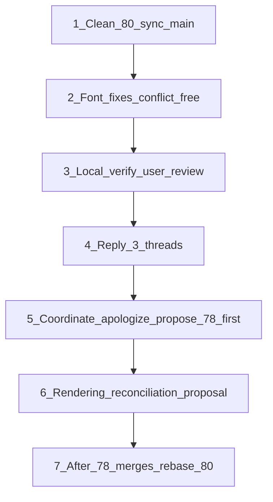

# PR #80 ↔ PR #78: coordination + TRMNL-aligned rendering plan

Draft replies live in [`docs/pr-80-review-replies.md`](docs/pr-80-review-replies.md) — paste on GitHub threads as each commit lands, delete before merge.

## Current state (updated 2026-06-29)

| Item | Status |
|------|--------|
| PR #80 (`feat/pixel-font-rendering`) | Review fixes pushed; **CHANGES_REQUESTED**; **MERGEABLE/CLEAN**; rbouteiller **agreed** on palette alignment (16:31 UTC) |
| PR #78 (`fix/remove-grayscale-parameter`) | Head still `140d41c` (2026-06-24) — **no code push in last 2h**; Rémi said "will fix" palette-gray-levels fold |
| Local `pr-78-work` | Uncommitted exploration edits — **do not push**; discard before switching back to #80 branch |
| Merge order | **#78 first**, then rebase #80; we comment on #78 (impl notes), not commit code there |
| Comment drafts | [`docs/pr-78-80-coordination-drafts.md`](docs/pr-78-80-coordination-drafts.md) — **not posted yet** |

### Key insight — shared foundation, not competing pipelines

Both PRs branch from the **same** `main` commit (`4089584`). The palette-as-source-of-truth renderer — [`lib/trmnl/palette-colors.ts`](lib/trmnl/palette-colors.ts) + the Lab nearest-color quantizer in [`lib/render/device-image.ts`](lib/render/device-image.ts) — and [`data/trmnl/palettes.json`](data/trmnl/palettes.json) are **already on main**. We're not reconciling two philosophies; we're merging two extensions of one shared model.



---

## BYOS vs TRMNL Framework — why alignment still matters

Reference: [TRMNL Framework v3.1 Image docs](https://trmnl.com/framework/docs/3.1/image), [Structure](https://trmnl.com/framework/docs/3.1/structure), [Colors](https://trmnl.com/framework/docs/3.1/colors).

| Dimension | TRMNL Framework | BYOS Next (this repo) |
|-----------|-----------------|----------------------|
| Authoring | Specialized HTML + utility classes (`bg--gray-50`, `image-dither`, `layout--row`) | React recipes first; Liquid/HTML for legacy plugins |
| Default renderer | Chrome + `plugins.css` / `plugins.js` + Framework Runtime post-processing | **Takumi/Satori** (no browser head) → PNG → sharp palette quantization |
| Parity lane | Same browser stack everywhere | `REACT_RENDERER=browser` or Liquid → Puppeteer (optional, heavier) |
| Dithering | Declarative CSS (`image-dither`); device preview rewrites tokens by bit depth | Server-side (`dither-image.ts`, `device-image.ts`) + `PreSatori` dither-* patterns |
| Palette truth | SCSS tokens with per-bit-depth overrides | `palettes.json` + `getPaletteGrayLevels` / Lab nearest-color |
| Layout | Fixed `Screen → View → Layout` hierarchy + CSS variables | `ScreenProfile` logical canvas + React primitives (`ScreenCanvas`, etc.) |
| Fonts | Framework bundles (NicoClean, BlockKie, …) via CSS | Vector via Takumi + **curated bitmap font packs** (BYOS-specific) |

**Shared outcome, different mechanism:** both systems produce palette-correct bitmaps for e-ink. TRMNL simulates devices by **re-evaluating HTML under CSS variable matrices** (docs device dropdown = bit depth, density, color mode). BYOS achieves similar outcomes by **React layout + post-render quantization** without owning the full Framework Runtime.

**What #80 should NOT try to do:** port Framework Runtime (clamp, overflow, fit-value, content-limiter, bit-depth visibility prefixes like `md:2bit:flex`) into Takumi in this pass.

**What #80 SHOULD do:** keep palette-as-source-of-truth semantics — dither `levels` from `getPaletteGrayLevels(palette)`, not an independent grayscale knob — so BYOS output matches TRMNL's *device contract* even when the *API surface* differs.

**Image API gap (document, don't block #80):**

| Framework | BYOS today |
|-----------|------------|
| `image-dither` on `` | `prepareForDevice` + server dither |
| `image--fill/contain/cover` | sharp `fit` in embed path |
| Bit-depth CSS selectors | `screen.bitDepth` / palette id in TS |

Closing class-level parity is follow-up shim work or browser mode — not a pipeline rewrite.

---

## 1. Clean up #80 (do now, independent of merge order)

Baseline hygiene: a clean PR is easier for `rbouteiller` to reason about even if it merges second.

**4 conflicting files** — keep both sides:

| File | Ours | Main (#79) |
|------|------|------------|
| [`app/(auth)/sign-in/sign-in-form.tsx`](<app/(auth)/sign-in/sign-in-form.tsx>) | Password visibility toggle | Auth redirect fix, `SubmitEvent` |
| [`app/layout.tsx`](app/layout.tsx) | `suppressHydrationWarning` | `getAppBaseUrl()` metadata |
| [`components/device/device-edit-form.tsx`](components/device/device-edit-form.tsx) | Copy tweak | `SubmitEvent` type |
| [`components/recipes/screen-params-form.tsx`](components/recipes/screen-params-form.tsx) | Select for enum params | `SubmitEvent` type |

---

## 2. Conflict-free font-system fixes (do now)

None of these files are touched by #78 (only `package.json`/`pnpm-lock.yaml` overlap), so this carries near-zero conflict risk and directly answers the review.

- **`tmp/geist.v2.json`** → delete. Unreferenced debug trace. Agree with reviewer.
- **`scripts/lib/*.mjs` ↔ `lib/bitmap-font/*.ts`** → dedupe. Source of truth = [`lib/bitmap-font/`](lib/bitmap-font/) (typed/tested). Delete `scripts/lib/{convert-legacy-font,decode-cell-data,metrics-derive,trace-core}.mjs`; scripts import TS via `node --experimental-strip-types`. Keep script-only I/O: `trace-glyph-node.mjs`, `discover-pixel-grid.mjs`, `trace-layout.mjs`.
- **Generated font packs** → commit as **curated artifacts**, but stop auto-regenerating: remove `generate:fonts` from `prebuild`/`dev` in [`package.json`](package.json) so `pnpm build` cannot clobber hand-edited packs. Keep `pnpm generate:fonts` as an explicit manual assistant. Document trace → designer curation → commit in [`docs/pixel-font.md`](docs/pixel-font.md).

---

## 3. Reply to the 3 review threads (drafts in [`docs/pr-80-review-replies.md`](docs/pr-80-review-replies.md))

| Thread | Reply stance |
|--------|--------------|
| `tmp/geist.v2.json` | Agree, deleted. |
| `block-kie.json` "commit generated or README step?" | These are **lossy-traced + hand-tuned** packs, not disposable build output → commit. **Acknowledge** his generation-over-commit lean (he removed generated schema artifacts in #78 `refactor: validate TRMNL registry contracts`) before making the curated-artifact case. |
| `scripts/lib` duplication | Agreed; unified onto `lib/bitmap-font/`. |

---

## 4. Acknowledge + coordinate (the relationship move)

Top-level comment on #80 (and a note on #78). Tone: honest, collaborative — we're both author/reviewer for each other.

> "Sorry — I should have read #78 more carefully before pushing #80; I've now gone through it properly. I agree we should rethink the render path together. #78 reworks the palette/grayscale model my dithering sits on, so let's **land #78 first**; I'll then rebase #80 on top and reconcile dithering with the palette-derived levels. In the meantime I've addressed your 3 points on #80 and kept it conflict-free."

Optional addendum (BYOS positioning, if useful):

> Our default path stays Takumi-first (no browser head); palette quantization + dither levels follow `palettes.json` the same way Framework `image-dither` follows device bit depth — different mechanism, same device contract. Happy to align on level counts and dither pattern policy with you since the Python firmware path is canonical.

---

## 5. Rendering reconciliation — align with TRMNL, leave the call to them

**Philosophy (TRMNL Framework v3.1 + `palettes.json`):** the palette declares per-device levels/colors and bit depth; the renderer quantizes to it; **dithering simulates richer tones on low-bit displays** ([Framework `image-dither`](https://trmnl.com/framework/docs/3.1/image)). This is exactly what #80's dithering should do — *for* the palette, not *instead of* it.

Device classes:

| Device | Palette | Mechanism |
|--------|---------|-----------|
| TRMNL (original) | `bw` (1-bit) | dither → 2 levels |
| TRMNL OG | `color-4bwry` (B/W/R/Y) | nearest-color (Lab) |
| TRMNL X | `gray-16` (4-bit) | dither → 16 levels |

**Agreed with rbouteiller (2026-06-29):** palettes.json SSOT, `getPaletteGrayLevels(palette)`, Takumi-first, levels follow palette like Framework `image-dither`. He will fold `palette-gray-levels.ts` on #78.

**Revised unification (split by PR):**

| Concern | #78 (Rémi) | #80 (us, after rebase) |
|---------|------------|------------------------|
| Gray-level resolver | Add `getPaletteGrayLevels(palette)` in `palette-colors.ts`; remove hardcoded BMP map | Consume from main — **no duplicate** |
| Device quantizer default | Hard-quantize to palette; fix routing so grayscale doesn't always hit FS `quantizeToPalette` | Keep hard-quantize default for UI/text |
| Photo dither | Out of scope | Opt-in only: Bayer / white-noise via `prepareForDevice` — **not Floyd–Steinberg on whole frame** |
| Bitmap fonts / 2× pipeline | Out of scope | v2 fonts, remove supersampling, curation workflow |

**Implementation notes for #78 comment (see drafts file):**

- Three gray-level mechanisms today: hardcoded BMP map, inline `palette.grays`, `palettes.json` (should be one).
- Routing bug: `resolvePaletteColors` returns gray RGB list → `quantizeToGrayLevels` unreachable → all grayscale hits mandatory FS in `quantizeToPalette`.
- FS on full frame blurs text and speckles flat fills (`responsive-example`).

**Do not push local `pr-78-work` exploration to #78** — Rémi owns the palette fold.

---

## 6. After #78 merges — rebase #80

Rebase `feat/pixel-font-rendering` onto new main, then decide:

- **Rebase-on-top:** keep #80 as a follow-up PR layering dithering + bitmap fonts over #78. (Default.)
- **Migrate:** move the dithering/bitmap-font deltas into a fresh branch off post-#78 main if history is too tangled.

High-overlap files to reconcile: `recipe-renderer.ts`, `rasterize.ts`, `device-image.ts`, palette helpers, `device-edit-form.tsx`, `device-view.tsx`, `calendar.tsx`.

---

## Sequence (local work first)

| # | Local commit | Verify before push |
|---|--------------|-------------------|
| 1 | `merge: sync with main` (resolve 4 conflicts) | lint, typecheck, test, build |
| 2 | `chore: remove unreferenced tmp/geist.v2.json` | same |
| 3 | `refactor: dedupe bitmap-font scripts into lib/bitmap-font` | same + `pnpm generate:fonts` still runs if invoked manually |
| 4 | `docs: clarify font pack curation; stop auto-regen on build` | same + confirm build does not rewrite `components/bitmap-font/generated/*.json` |
| 5 | — (no commit) | User spot-checks `/recipes/[slug]` BMP preview on OG + TRMNL X |
| 6 | (after #78 merges) `rebase onto main` + render reconciliation | full verify again |

**Gate:** do **not** `git push` until the user has reviewed the local diff and signed off on spot-checks.

---

## GitHub actions (after local review + user sign-off)

Use `gh` from repo root on branch `feat/pixel-font-rendering`. Run GitHub steps **only after** commits are pushed and CI is green.

### A. Push (user-approved only)

```bash
git push -u origin feat/pixel-font-rendering
```

Watch CI:

```bash
gh pr checks 80 --watch
```

### B. Inline replies on review threads

Comment IDs (as of plan update):

| Thread | `gh` reply target |
|--------|-------------------|
| `tmp/geist.v2.json` | `--in-reply-to 3481961287` |
| `block-kie.json` | `--in-reply-to 3482090120` |
| Top-level script duplication | new PR comment (no inline id) |

**After commit 2** — tmp thread:

```bash
gh api repos/usetrmnl/byos_next/pulls/80/comments \
  -f body="Yes — deleted. It was a one-off trace/debug output, not referenced anywhere." \
  -F in_reply_to=3481961287
```

**After commit 3** — top-level script duplication (new comment on PR):

```bash
gh pr comment 80 --body "$(cat <<'EOF'
Agreed — the duplicated modules were a mistake from porting trace logic to TS for runtime/tests while leaving `.mjs` copies for the generator scripts.

This commit removes the duplicates in `scripts/lib/{convert-legacy-font,decode-cell-data,metrics-derive,trace-core}.mjs` and has the scripts import from `lib/bitmap-font/*.ts` instead (Node 22 strip-types). Script-only I/O stays in `scripts/lib/` (`trace-glyph-node`, `discover-pixel-grid`, `trace-layout`).

`lib/bitmap-font/` is the single surface for runtime + tests; scripts are thin callers.
EOF
)"
```

**After commit 4** — block-kie thread (paste full draft from [`docs/pr-80-review-replies.md`](docs/pr-80-review-replies.md)):

```bash
gh api repos/usetrmnl/byos_next/pulls/80/comments \
  -f body="$(cat docs/pr-80-review-replies.md | sed -n '/^## Inline — `components\/bitmap-font\/generated\/block-kie.json`/,/^---/p' | tail -n +5 | head -n -1)" \
  -F in_reply_to=3482090120
```

Or paste manually from the draft file if the heredoc is awkward.

### C. Coordination comment + re-request review (after commits 1–4 pushed)

```bash
gh pr comment 80 --body "$(cat <<'EOF'
Sorry — I should have read #78 more carefully before pushing #80; I've now gone through it properly. I agree we should rethink the render path together. #78 reworks the palette/grayscale model my dithering sits on, so let's **land #78 first**; I'll then rebase #80 on top and reconcile dithering with the palette-derived levels.

Addressed review feedback:
- Removed `tmp/geist.v2.json`
- Committed font packs as curated artifacts; documented curation workflow; stopped auto-regenerating packs on build
- Unified `scripts/lib` duplicates into `lib/bitmap-font`
- Synced with `main` (sign-in reliability + layout conflicts resolved)

Our default path stays Takumi-first; palette/dither levels follow `palettes.json` the same way Framework `image-dither` follows device bit depth — different mechanism, same device contract. Happy to align on level counts and dither pattern policy with you.

Ready for another look when you have time.
EOF
)"

gh pr edit 80 --add-reviewer rbouteiller
```

Optional cross-link on #78:

```bash
gh pr comment 78 --body "Coordination note: planning to land this first, then rebase #80 (bitmap fonts + dithering) on top. See #80 for context."
```

### D. What gh CLI cannot do — manual fallback

| Action | Fallback |
|--------|----------|
| Resolve review threads in GitHub UI | Click **Resolve conversation** on each thread after posting reply |
| Re-request review if `gh pr edit --add-reviewer` fails | PR sidebar → **Re-request review** |
| Merge #78 | Maintainer action; do not merge #80 until #78 is on main |
| Delete `docs/pr-80-review-replies.md` before merge | Local commit or leave untracked; never commit long-term |

### E. After #78 merges (phase 2)

```bash
git fetch origin main
git rebase origin/main   # or fresh branch — see section 6
pnpm lint && pnpm typecheck && pnpm test && pnpm build
# user review again
git push --force-with-lease origin feat/pixel-font-rendering
gh pr comment 80 --body "Rebased onto main after #78 merge; render path reconciled with palette-derived dither levels. Ready for another pass."
gh pr edit 80 --add-reviewer rbouteiller
```

---

## Not in this pass

- Improving the trace algorithm to full automation (follow-up).
- Final decision on per-model level counts / dither pattern (TRMNL's call).
- Framework Runtime modulations (clamp, overflow, fit-value, bit-depth visibility prefixes).
- `image-dither` / `image--cover` React utility shims (browser mode or follow-up).
- Release-workflow notes in PR description.
