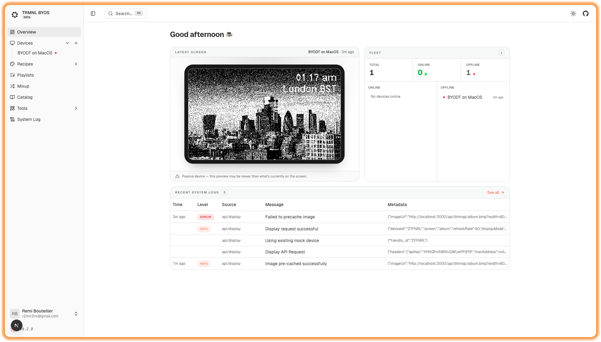

# BYOS Next.js for TRMNL 🖥️

[](LICENSE)
[](https://nextjs.org/)
[](https://react.dev/)
[](https://tailwindcss.com/)
[](https://www.typescriptlang.org/)
[](https://supabase.com/)
[](https://github.com/usetrmnl/byos_next/pulls)
[](https://github.com/usetrmnl/byos_next/stargazers)
[](https://github.com/usetrmnl/byos_next/network/members)

## 🚀 Overview
**BYOS (Build Your Own Server) Next.js** is a Next.js implementation that powers device management, playlist-driven content scheduling, and on-demand BMP generation for e-ink displays.

[](https://vercel.com/new/clone?repository-url=https%3A%2F%2Fgithub.com%2Fusetrmnl%2Fbyos_next&env=AUTH_ENABLED&envDefaults=%7B%22AUTH_ENABLED%22%3A%22false%22%7D&envDescription=User%20authentication%20is%20disabled.&envLink=https%3A%2F%2Fgithub.com%2Fusetrmnl%2Fbyos_next%3Ftab%3Dreadme-ov-file&project-name=byos-next&repository-name=byos_next&demo-title=BYOS%20NextJS&demo-description=BYOS%20(Build%20Your%20Own%20Server)%20Next.js%2C%20TRMNL%20server%20with%20local%20recipe%20rendering%20and%20cloud%20proxy%20support.&demo-url=https%3A%2F%2Fbyos-next-demo.vercel.app&demo-image=https%3A%2F%2Fusetrmnl.com%2Fimages%2Fbrand%2Ficons%2Ficon--brand.svg&products=%5B%7B%22type%22%3A%22integration%22%2C%22integrationSlug%22%3A%22neon%22%2C%22productSlug%22%3A%22neon%22%2C%22protocol%22%3A%22storage%22%2C%22group%22%3A%22postgres%22%7D%5D)

### ✨ Features
- Device management UI with MAC/API key registration, status tracking, and refresh scheduling.
- Playlist-based screen rotation with time and weekday rules, custom durations, and per-device assignment.
- On-demand screen rendering to 1-bit BMP via Takumi/Satori with caching and revalidation.
- Postgres backed persistence for devices, logs, and playlists.
- Recipes gallery to prototype screens and compare direct vs. bitmap rendering before pushing to hardware.
- Tailwind v4 + TypeScript + Next.js 16 + React 19; Biome lint/format baseline.
- Docker Compose for app + Postgres; deploy-ready Vercel button with Supabase/Neon integration.

## Table of Contents
- [BYOS Next.js for TRMNL 🖥️](#byos-nextjs-for-trmnl-️)
  - [🚀 Overview](#-overview)
    - [✨ Features](#-features)
  - [Table of Contents](#table-of-contents)
  - [Highlights](#highlights)
  - [Demo \& Screens](#demo--screens)
  - [Quickstart](#quickstart)
    - [Deploy to Vercel](#deploy-to-vercel)
    - [Run with Docker Compose (app + Postgres)](#run-with-docker-compose-app--postgres)
    - [Run Locally](#run-locally)
  - [Environment](#environment)
    - [Renderer Options](#renderer-options)
    - [Database Options](#database-options)
  - [Project Structure](#project-structure)
  - [Playlists](#playlists)
  - [Recipes](#recipes)
  - [Documentation](#documentation)
  - [Roadmap](#roadmap)
  - [Support \& Feedback](#support--feedback)
  - [License](#license)

## Highlights
- Dynamic BMP generation with Next.js 16, React 19, Tailwind CSS v4, and TypeScript.
- Supabase-backed device management, logging, and playlist scheduling.
- No-DB fallback mode for quickly previewing screens without a database.
- Docker Compose support for local PostgreSQL.
- Recipes gallery for rapid screen prototyping before deploying to devices.
- Clean codebase with Biome linting and formatting.

## Demo & Screens
- Live demo: [https://byos-next-demo.vercel.app](https://byos-next-demo.vercel.app)



## Quickstart

### Deploy to Vercel
1. Click the Vercel button above.
2. Link a Supabase or Neon project when prompted.
3. Deploy, then open the app and initialize tables.
4. Point your TRMNL device at the deployed URL.
5. Sync environment variables locally via `vercel link` and `vercel env pull` if you also develop on your machine.

### Run with Docker Compose (app + Postgres)
1. Copy `.env.example` to `.env` and fill in the required values. At minimum:
   ```
   POSTGRES_PASSWORD=your_password
   BETTER_AUTH_SECRET=a_random_32_character_secret
   ```
   `docker-compose.yml` reads from `.env` (not `.env.local`). Generate a secret with `openssl rand -base64 32`.
2. Start the stack:
   ```bash
   docker-compose up -d
   # visit http://localhost:3000
   ```

#### Browser-based renderer (optional)
For pixel-perfect TRMNL Framework UI compatibility, run the browser renderer alongside a headless Chrome container:
```bash
docker-compose -f docker-compose.yml -f docker-compose.browser.yml up -d
```
This sets `REACT_RENDERER=browser` and starts a Chromium debugger that renders recipes via `/recipes/[slug]/preview`. See the `Environment` section for renderer options.

### Run Locally
```bash
git clone https://github.com/usetrmnl/byos_next
cd byos_next
pnpm install
```

Start the dev server:
```bash
pnpm dev
```

Format/lint:
```bash
pnpm lint
```

## Environment
Create `.env.local` (for `pnpm dev`) or `.env` (for Docker Compose) with the keys you need. See `.env.example` for the full list. Common variables:

| Variable | Purpose |
| --- | --- |
| `DATABASE_URL` | Postgres connection string. |
| `POSTGRES_PASSWORD` | Used by `docker-compose.yml` to bootstrap the Postgres container. |
| `BETTER_AUTH_SECRET` | Required when `AUTH_ENABLED=true`. Generate with `openssl rand -base64 32`. |
| `BETTER_AUTH_URL` | Public URL of your deployment (defaults to `http://localhost:3000`). |
| `AUTH_ENABLED` | Set to `false` to disable authentication (mono-user mode). |
| `ADMIN_EMAIL` | Email that receives admin role on first sign-up. |
| `REACT_RENDERER` | `takumi` (default), `satori`, or `browser`. See below. |
| `ENABLE_EXTERNAL_CATALOG` | Allow fetching the community / TRMNL recipe catalog. |

### Renderer Options
- **`takumi`** (default): fast Rust-backed Satori-compatible renderer.
- **`satori`**: original Vercel Satori renderer.
- **`browser`**: headless Chrome via `puppeteer-core`, required for full TRMNL Framework UI components and pixel-perfect parity with the official cloud. Use the `docker-compose.browser.yml` overlay or set `BROWSER_URL` to a reachable Chrome DevTools endpoint.

### Database Options
- **Supabase or Neon:** run migrations in `migrations/` in order, or use the in-app Initialize button on first launch. **Note:** migration `0009_add_user_tenancy.sql` assumes a `postgres` superuser role. On managed providers where the connection role differs, edit `GRANT byos_app TO <your_role>` before running it (see [#46](https://github.com/usetrmnl/byos_next/issues/46)).
- **Docker/Postgres:** set `POSTGRES_PASSWORD` and `BETTER_AUTH_SECRET` in `.env`, then run `docker-compose up -d`.
- **No-DB mode:** run `pnpm dev` without DB env vars to preview screens only (device management disabled).

## Project Structure
- `app/` - Next.js routes and screens (including `/recipes`).
- `components/` - UI components.
- `migrations/` - SQL migrations for Postgres.
- `public/` - Static assets and screenshots.
- `scripts/`, `utils/`, `lib/` - helpers for rendering, caching, and device logic.
- `docs/api.md` - HTTP API reference.

## Playlists
- Schedule screens by time and weekday with custom durations.
- Assign playlists to devices to rotate content automatically.
- Enable playlist mode per device in the UI.

## Recipes
Visit `/recipes` to browse screens and compare direct vs. bitmap rendering. To add one:
1. Create a folder under `app/(app)/recipes/screens/<slug>/`.
2. Add `<slug>.tsx` exporting `paramsSchema`, `dataSchema`, and a
   `definition` of type `RecipeDefinition<P, D>`.
3. That's it — the recipe index regenerates on `pnpm dev` and the
   sidebar picks it up automatically.

See `docs/recipes.md` for the full pattern, including data fetching.

## Documentation
- API endpoints and payloads: `docs/api.md`
- Recipes reference: `app/recipes/README.md`
- Contributing guide: `CONTRIBUTING.md`

## Roadmap
- Better recipe management system
- Compatibility with TRMNL recipes

## Support & Feedback
- GitHub Issues: https://github.com/usetrmnl/byos_next/issues
- Discussions: https://github.com/usetrmnl/byos_next/discussions
- Email: manglekuo@gmail.com
- TRMNL Discord: reply to the maintainer thread.

## License
MIT - see `LICENSE`.
